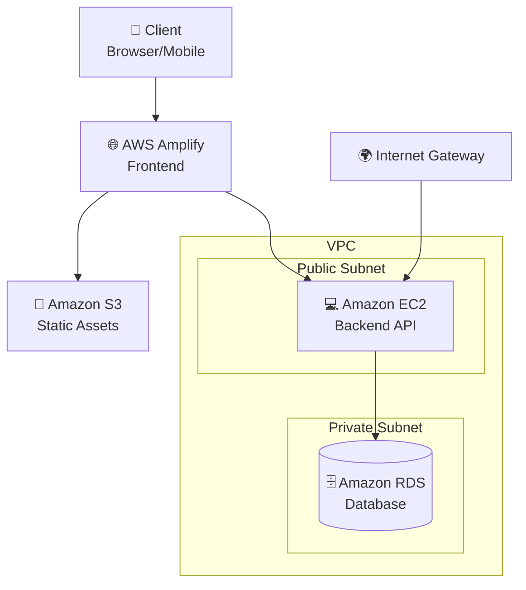

# 📦 AWS Inventory Management System

[](https://aws.amazon.com/)
[]()
[]()

> A comprehensive cloud-based inventory management system built on AWS services, designed to streamline business operations and enhance organizational efficiency.

## 🚀 Features

- ✅ **Real-time Inventory Tracking** - Monitor stock levels instantly
- ✅ **Multi-role User Management** - Support for owners, administrators, and employees  
- ✅ **Expense Management** - Track and categorize business expenses
- ✅ **Product Information Management** - Centralized product database
- ✅ **Automated Workflows** - Reduce manual processes and human error
- ✅ **Scalable Architecture** - Built on AWS for maximum reliability
- ✅ **Security First** - Private subnet database with proper access controls

## 🏗️ Architecture



## 🛠️ Tech Stack

| Layer | Service | Purpose |
|-------|---------|---------|
| **Frontend** | AWS Amplify | Web/Mobile app hosting |
| **Storage** | Amazon S3 | Static assets storage |
| **Backend** | Amazon EC2 | API server and business logic |
| **Database** | Amazon RDS | Data persistence |
| **Network** | VPC, Subnets | Secure network isolation |
| **Security** | Security Groups | Traffic control and access management |

## 📋 Prerequisites

- AWS Account with appropriate IAM permissions
- AWS CLI configured
- Node.js (v14 or higher)
- Git

## ⚡ Quick Start

### 1. Clone the Repository
```bash
git clone https://github.com/yourusername/aws-inventory-management.git
cd aws-inventory-management
```

### 2. Deploy Infrastructure
```bash
# Deploy VPC and networking
./scripts/deploy-infrastructure.sh

# Deploy database
./scripts/deploy-database.sh

# Deploy backend
./scripts/deploy-backend.sh

# Deploy frontend
./scripts/deploy-frontend.sh
```

### 3. Configure Environment
```bash
cp .env.example .env
# Edit .env with your AWS resources
```

### 4. Initialize Database
```bash
npm run db:migrate
npm run db:seed
```

## 🏛️ System Architecture

### Network Design
- **VPC**: Isolated cloud environment
- **Public Subnet**: EC2 instances with internet access
- **Private Subnet**: RDS database (no direct internet access)
- **Security Groups**: Firewall rules for each component

### Security Features
- 🔒 Database in private subnet
- 🛡️ Role-based access control
- 🔐 HTTPS encryption for all communications
- 🚨 Security group restrictions
- 📝 Audit logging

## 🚀 Deployment

### Environment Setup
```bash
# Install dependencies
npm install

# Configure AWS credentials
aws configure

# Deploy to staging
npm run deploy:staging

# Deploy to production
npm run deploy:production
```

### Infrastructure as Code
```bash
# Using AWS CDK
cdk deploy InventoryManagementStack

# Using Terraform (alternative)
terraform init
terraform plan
terraform apply
```

## 📊 API Documentation

### Authentication
```http
POST /api/auth/login
Content-Type: application/json

{
  "email": "user@example.com",
  "password": "password"
}
```

### Inventory Management
```http
# Get all inventory items
GET /api/inventory

# Create new item
POST /api/inventory
{
  "name": "Product Name",
  "quantity": 100,
  "price": 29.99
}

# Update item
PUT /api/inventory/:id

# Delete item
DELETE /api/inventory/:id
```

## 🧪 Testing

```bash
# Run unit tests
npm test

# Run integration tests
npm run test:integration

# Run e2e tests
npm run test:e2e

# Generate coverage report
npm run test:coverage
```

## 📈 Monitoring

### CloudWatch Integration
- Application logs
- Performance metrics
- Error tracking
- Cost monitoring

### Health Checks
```bash
# Check system health
curl https://your-api-domain.com/health

# Check database connectivity
npm run health:db
```

## 🔧 Configuration

### Environment Variables
```env
# AWS Configuration
AWS_REGION=us-east-1
AWS_ACCESS_KEY_ID=your_access_key
AWS_SECRET_ACCESS_KEY=your_secret_key

# Database Configuration
DB_HOST=your-rds-endpoint
DB_PORT=5432
DB_NAME=inventory_db
DB_USER=admin
DB_PASSWORD=your_password

# Application Configuration
NODE_ENV=production
PORT=3000
JWT_SECRET=your_jwt_secret
```


<div align="center">
  <strong>Built with ❤️ using AWS Services</strong>
</div>
